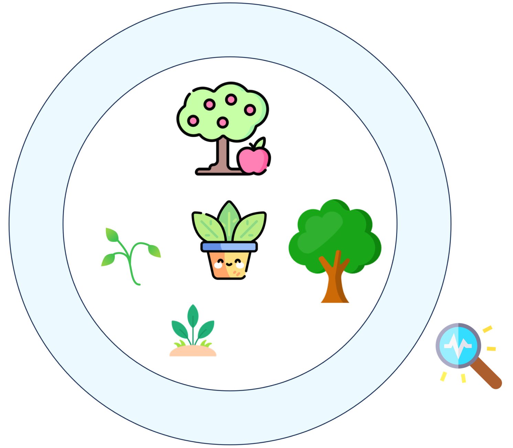

# PlantSR
Create more effcient super-resolution model for plant images!    
PlantSR v1.0 was published in [*Journal of imaging*](https://www.mdpi.com/2819270)   
PlantSR v2.0 previous version is now avaiable.
Update is on making ...

## Dataset
PlantSR Dataset could be downloaded from [Figshare](https://figshare.com/articles/dataset/PlantSR_Dataset/24648150)

## Pretrained models
Pretrained models trained with PlantSR dataset could be downloaded from [Dropbox](https://www.dropbox.com/scl/fo/k3xqyu3zomu3insdqydnz/h?rlkey=8mwov9xap0bwsvou0dui7drsq&dl=0)

## Start
Use PlantSR.ipynb to train and inference PlantSR model. Some other SR models could be found at "others" derectory.    
Use PlantSRv2.ipynb to train and inference PlantSRv2 model.

### P2PNet-Soy expriment could be found at [P2P-PlantSR](https://github.com/SkyCol/P2P-Soy-expriment)

### YOLOv7-apple expriment could be found at [YOLOv7-PlantSR](https://github.com/SkyCol/YOLOv7-apple-expriment) 
